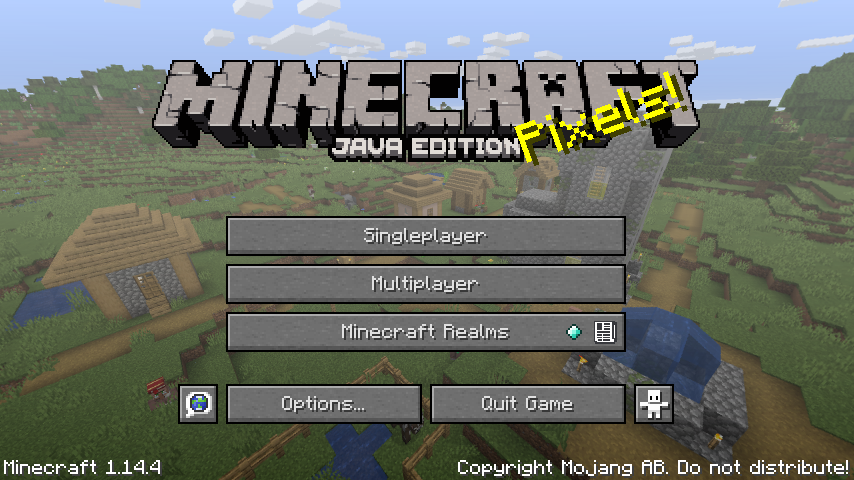
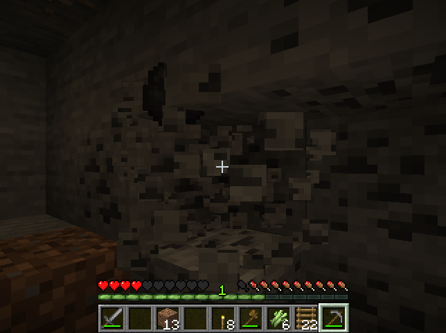

---
title: The Mechanics of Colonialism in Minecraft
author:
- Christine Lam
- Hannah May
- Ohana Turbak
- Peter Mawhorter
...

::::: {.body}

::: {.col}

# Colonialism and Games {.section}

- Colonialism seeks to justify and valorize colonial domination, like the ongoing domination of Native Americans by the United States of America.
- Popular culture spreads colonialist beliefs.
- Games can promote ideologies.¹
- Besides their 2D art, text, and sound, games include rules, also known as "mechanics."
- Rules themselves can communicate messages, including colonialist messages.

:::: {.fig}
{width=80%}\ 

The Minecraft title screen.
::::

# Minecraft {.section .alt}
- The best-selling game of all time (>176 million copies).
- A blocky world where any block can be mined.
    * Craft blocks into tools and other blocks.
    * Blocks can be placed to build things.
- Generated terrain includes a variety of climates, underground caves, and "natural resources" like ore.
- The world is populated by passive animals, aggressive monsters, benign "villagers," and evil "illagers."
    * Animals include livestock, pets, and wild animals.
    * Monsters appear at night and attack on sight.
    * Villagers live in villages and can be traded with.
    * Illagers appear randomly and attack immediately.

::::{.footnote}
¹ Bogost, Ian, *Persuasive Games*. MIT Press, 2007.
::::
:::

::: {.col}

# Colonialist Myths {.section .alt .doublewide}

- Game mechanics dictate what is true in the game world, and imply things about the real world.
- Several Minecraft mechanics support colonialist myths which help justify past and present colonial domination.²

## Accumulating Blocks

- Ore is finite, but can always find more by moving on.
- No large-scale consequences of extraction.
    * *Reinforces myth that 'natural resources' are plentiful and extracting them is harmless.*
- Mass extraction is made easy due to enormous inventory.

## Terrain and Exploration

- Most generated terrain is uninhabited.
    * *Reinforces myth of the 'wild frontier.'*
- Villagers don't use land outside of their small villages.
- Maps position player as discoverer.
    * *Reinforces myth of of Western 'discovery.'*

:::: {.fig}
\ 
\ 
\ 
\ 

Clockwise from top left: 1. Mining coal; 2. A map being filled in;  3. A pair of villagers; 4. A skeleton monster.
::::

::::{.footnote}
² Dooghan, Daniel, *Digital Conquerors: Minecraft and the Apologetics of Neoliberalism*. In *Games and Culture* v. 14, 2016.
::::
:::

::: {.col}

\ 

\ 

## Monsters and Illagers

- Intelligent, but unconditionally attack player on sight.
- Implies some creatures are inherently/irredeemably evil.
    * *Reinforces myth that morality/behavior is biologically determined, and justifies aggression as self-defense.*

## Villagers

- No combat, building, or crafting ability (despite living in constructed dwellings).
- Not shown as builders of advanced ruins like shipwrecks.
    * *Reinforces myth that Natives had no technology.*
- Depend on player for defense against monsters.
    * Ironically, monsters are only attracted by player.
    * Sets up player as "savior," villagers as beneficiaries.
    * *Reinforces myth that Natives were helpless and benefited from colonialism.*

## Advancements

- Tutorial & achievement system rewards certain actions.
    * *Incentivizes colonialist activities (even killing villagers).*
- Provides an overarching narrative of progress.

# Impacts {.section}

- Some players and fans revel in colonialist fantasies (*"...who doesn't want to be all barbarian and destroy every village[?]"* from [the Minecraft Wiki tutorial on Colonizing](https://minecraft.gamepedia.com/Tutorials/Colonizing)).
- Mechanics support explicit teaching of colonialist myths (e.g., a ["British Colonisation" lesson](https://education.minecraft.net/lessons/british-colonisation/) on the [Minecraft Education Edition site](https://education.minecraft.net/) to teach about *"what the settlers went through"* in Australia).
- These myths cause demonstrable psychological harm.³
- Similar mechanics exist in many game genres, because mechanics are often uncritically copied between games.

::::{.footnote}
³ Stegman, Erik and Phillips, Victoria F., *Missing the Point: The Real Impact of Native Mascots and Team Names on American Indian
and Alaska Native Youth*. Center for American Progress, July 2014.
::::

:::

:::::
