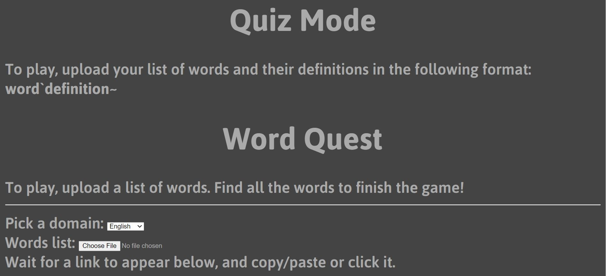
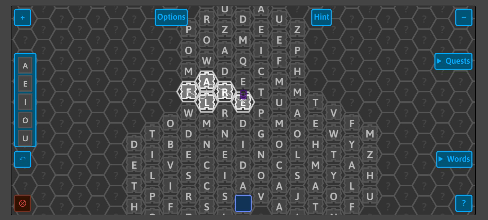

---
title: Words Game Sprint 1
author: Katherine Avila, Anastacia Castro, Elizabeth Huang, Farida Tahiry, and Peter Mawhorter
date: Summer 2020
...

<nav>
[Report Summary](../report.html)
[Sprint 1 Features](sprint1.html)
[Sprint 2 Features](../sprint2/sprint2.html)
[Words Game](https://solsword.github.io/words/)
[Words Github Page](https://github.com/solsword/words/)
[Anarchy Library](https://solsword.github.io/anarchy/)
</nav>

::::: {.body}

::: {.col}

## GLYPHS MENU

:::

::: {.col}

## QUIZ MODE

If you would like to use this feature, we have a game initialized with a demo word list linked <a href="https://solsword.github.io/words/index.html#mode=quiz,words=science`definition%25201~computer`definition%25202~coding`definition%25203~html`definition%25204~css`definition%25205~javascript`definition%25206,domain=English">here</a>. You can also upload your own file into the quiz mode at this link: <a href="../start_quiz.html">Start Quiz</a>.

:::: {.quiz_image_grid}

::::

### About Quiz Mode

In quiz mode, a user can upload a custom word list on a separate page from Words. 
First, the user must create a text file. The format for putting words into the file is described on the "Start Quiz" page linked above.
Once they have their text file ready, they can choose which 'domain' that their text file falls under. 
Currently, our program supports English, Japanese (ひらがな), Turkish (türk), Chinese idioms (成语), and Arabic (عربى).
Then, our program generates a link that encodes the words (and their definitions, if applicable) so that Words knows which words to use in the custom version of the game.
Right now, our game does not have the capability to use the definitions, but we hope that someone will add that into a future version of the game.

The traditional Words game is an indefinite board, but this feature creates a finite board that includes the words it is given in addition to a few other randomized words.
Once the game is created, the user can view the words that they need to find under the "Quests" menu.
As they find each word, the word will be marked with a check in that menu.
Users can also find other words that are randomly created as they play, but they do not count towards completing the quest.
After finding all of the words, the user can open the "Quests" menu and click the check next to the quest that shows the quest is completed.
Then, a dialog box appears to ask the user if they would like to start a new game or scramble the words of the current game to play again.
Creating a new game will take the user back to the "Start Quiz" page.
Choosing to scramble the words again changes the randomized seed used to create the game. 

Seeds are related to how the game is randomized.
Words is dependent on another code library built by Peter Mawhorter called "anarchy."
The point of that library is to create a way for randomized decisions to happen.
The process that computers use to generate random numbers is actually mathematically based, so they are not as random as they appear. 
Each seed describes the pattern used to generate the random numbers.
That is why each time you play the game with the same seed and same set of words, they will end up in the same place.
 
### Process of Creating Quiz Mode

For reference, HTML, CSS, and JavaScript are the three main programming languages behind every website you see. 
HTML (Hypertext Markup Language) creates the bare bones of every website. It can be used to add text, images, and videos, among other things, and it differentiates various sections of each website.
CSS (Cascading Style Sheets) styles the HTML so that it looks more attractive. It can change colors, fonts, and sizes of objects, as well as shape the design in many other ways.
JavaScript mostly deals with how the user interacts with a webpage. It runs code as you click buttons and scroll around a webpage.

To create our feature, we first had to create an HTML document for the user to upload their word list.
Then, we used JavaScript to take the input given by the user (the domain and file) and transform it into something that Words could use.
We decided the best way to do this was by creating a link because it's a simple way to pass information between different websites.

Once the user clicks the link, they get taken to Words which is where we take the information from the link to create a new game. 
Words already had the capability to create a custom dimension, so once we broke down the information from the URL, we put the words from the given word list into the property of the custom dimension that held its word list.

### Challenges

One of the first challenges we ran into was figuring out whether to capitalize letters. 
Not every language has a sense of "uppercase" and "lowercase" letters like there is in English. 
We had to create a function that determined whether the applicable domain had letters (or glyphs) that could be capitalized, and if so, we had to develop the functionality to capitalize all the letters in the user's uploaded word list.

We also found that some words from our uploaded word list were not recognized as valid words by the program.
To  fix this problem, we had to redefine what it meant for a word to be considered valid.
Originally, Words determined whether a word was valid based on whether or not it was in one of the larger word lists (domains) that make up the game. 
We had to also allow for the case in which a word was not in a domain but was given to Words in the user's custom word list.

Another challenge that our group encountered was how to encode the words and definitions together. 
We ultimately decided on using a URL, but that might need to be changed later.
A URL has a set maximum length which might cause trouble for larger word lists.
If a list only had words, someone could upload more than 200 words of average length into the game.
However, once definitions are also added into the mix, it gets easier to reach the maximum length limit of a URL.
Possible solutions to this problem include using the cookies of a website or sending the words through a form via a POST request.
We hope that groups in the future can find a viable solution to this problem.

### Future Work

As a word finding game that uses multiple languages, Words has the capability to be used in language pedagogy.
By using definitions in quiz mode later, Words could have applications in the classroom as a way to review vocabulary.
Right now, players can at least practice finding and spelling words, but hopefully in the future, they can also define words for learning purposes.
With the current capabilities of the game, teachers can possibly send their students a link to a preset game with the given list of words that they need to review which can be useful in a classroom setting.

:::

:::::
