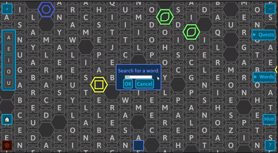

---
title: Words Game Sprint 2
author: Katherine Avila, Anastacia Castro, Elizabeth Huang, Farida Tahiry, and Peter Mawhorter
date: Summer 2020
...

<nav>
[Report Summary](../report.html)
[Sprint 1 Features](../sprint1/sprint1.html)
[Sprint 2 Features](sprint2.html)
[Words Game](https://solsword.github.io/words/)
[Words Github Page](https://github.com/solsword/words/)
[Anarchy Library](https://solsword.github.io/anarchy/)
</nav>

::::: {.body}

::: {.col}

# HINT FEATURE

## Hint About

The hint feature is a menu button that the user can click on and see if the word they typed in is in the current screen they are on. If the word is present, the screen is highlighted to show where the word(s) are. The first letter of the word is searched in the current screen, then it checks to see if any of the letters around match the second letter of the word. If it doesn’t, that match is dismissed and if it does, it repeats the search around that new glyph to check for the next letter. Once it has done this to each letter of the word, the animation mechanism highlights where the first glyph of the sequence of the word is and it lasts seconds before it goes away.

## Why did we create a hint feature?
We wanted to create this feature because this was an idea that we discussed when preparing for sprint 1. From experience from word games, we usually get stuck and so wanted a way to help the users if they came across this.

The animation above shows the how the hint feature works when the user types in the word 'pea'

### Future Work

Right now, the user can use the hint as many times as they want; therefore, we hope to later modify it to limit the number of hints the user can utilize, that way this could be a replacement for a reward. In the future, we hope to explore how to change the way the animation is displayed.

:::

::: {.col}

# AVATAR FEATURE

## Avatar About

The avatar feature allows the player to pick an avatar and it will remain on the game board as the player plays the word game. As soon as the game is loaded, an avatar will appear at the center of the unlocked tiles. There is now an options menu that allows the player to change the avatar that is currently on the board. As the player connects and deletes the glyphs they have selected, the avatar will follow along the path. Once a word is completed, the avatar does a little jump animation at the end.

## Why did we create an avatar feature?

We wanted to create this feature so that players can be more engaged with the game. An avatar could give a player a sense of connection to the game by seeing a character on the game board. We are also hoping this feature lies the foundation for future characters in the game as well!

▴ The avatar follows the glyphs as the player swipes and plays an animation once the word is completed.

▴ The player has the option to change the random avatar that is placed on the center of the board through the options menu.

## Challenges

A challenge I faced when designing and animating the avatar was learning the SVG format and how to animate for the first time. It took a while to figure how to convert between different files and to finally get it working and presenting on the game. Another challenge was understanding how HTML elements and event handlers work on a web page to accurately place our avatar on the game board.

### Future Work on Avatars

We hope that in the future the avatar feature will be modified such that players will be able to provide their own avatar drawing and animation or otherwise customize their avatar. This also provides the foundation for the possibility of non-player characters (NPCs) that could appear when playing the game as well as a stronger sense of player identity in a word game.

:::

:::::
